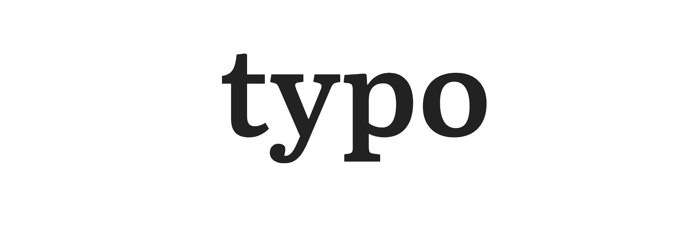
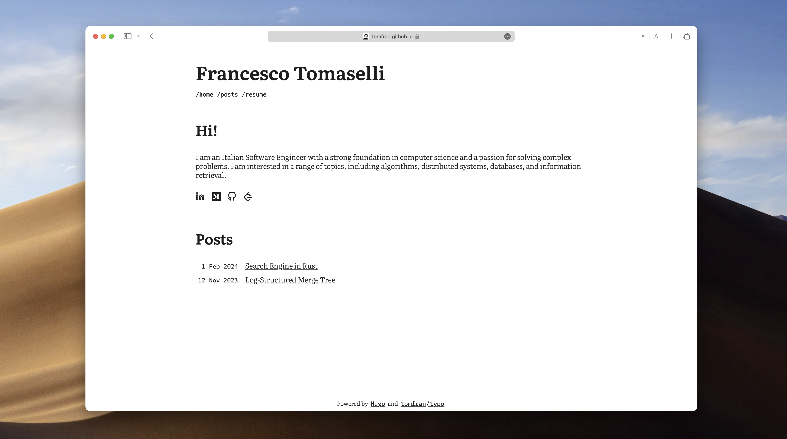
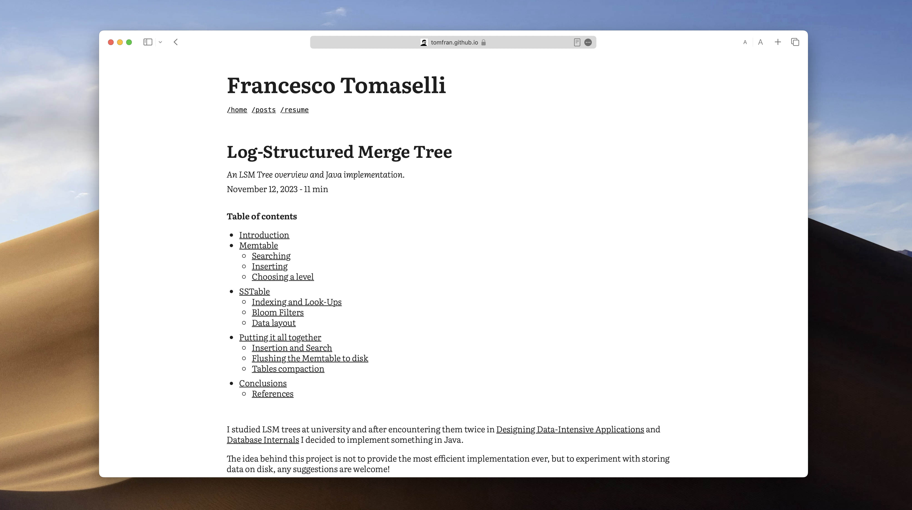
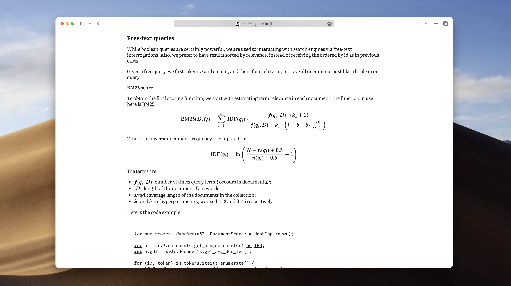

# Typo, a Hugo theme.

**Homepage**



**Article**






## Installation

To receive updates, add the theme as a submodule: 
```
git submodule add git@github.com:tomfran/typo.git themes/typo
```

Otherwise you can clone the repo and copy it manually to yout theme folder.

## Peculiarities

**Latex and code overflow on mobile**

...

**Dark and Light mode tags for images**

...

## Configuration example

**post.md**

```md
---
title: "Search Engine in Rust"
date: "2024-02-01"
summary: "A search engine overview and Rust implementation."
toc: true 
readTime: true
autonumber: true
---

...
```

**hugo.toml**

```toml
baseURL = 'https://example.org/'
languageCode = 'en-us'
title = 'Francesco Tomaselli'
theme = 'Typo'

# Disable tags
disableKinds = ['taxonomy']

# Google analytics code
googleAnalytics = "G-xxxxxxxxxx"

[params]
# Math mode
math = true

# Intro on main page, content in markdown
homeIntro = true
homeIntroTitle = 'Hi!'
homeIntroContent = """
I am an Italian Software Engineer with a strong foundation in computer science and a passion for solving complex problems.
I am interested in a range of topics, including algorithms, distributed systems, databases, and information retrieval.
"""

# Collection to display on home
homeCollectionTitle = 'Posts'
homeCollection = 'posts'

# Pagination size across all website
paginationSize = 100

# Social icons
[[params.social]]
name = "linkedin"
url = "https://www.linkedin.com/in/your-name"

[[params.social]]
name = "medium"
url = "https://medium.com/@your-name"

[[params.social]]
name = "github"
url = "https://github.com/your-name"

# Main menu pages
[[params.menu]]
name = "home"
url = "/"

[[params.menu]]
name = "posts"
url = "/posts"

[[params.menu]]
name = "resume"
url = "/resume"

# Syntax highligth on code blocks, all styles: 
# https://xyproto.github.io/splash/docs/all.html
[markup]
[markup.highlight]
style = 'algol'
```
