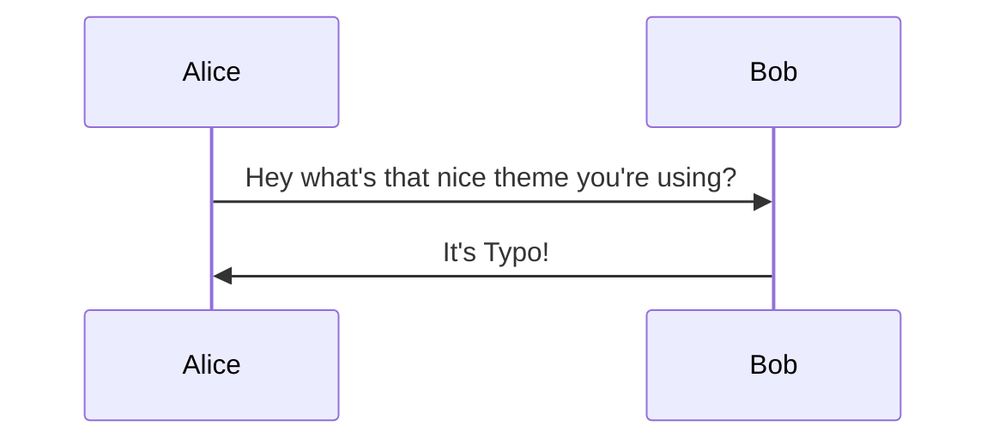

Miscellaneous settings.

## Home Meta Description

You can specify the homepage meta description with the following parameter:

```toml
[params]
description = "Your description"
```

## Breadcrumbs

Show breadcrumbs on pages.

Example:

```toml
[params.breadcrumbs]
enabled = true
showCurrentPage = true
home = "~"
```

Set `enabled` to `false` if you want to hide breadcrumbs. By default, breadcrumbs are shown.

Set `showCurrentPage` to `false` to hide the last crumb, i.e, the current page.

`home` when set with a non-empty string, uses the latter as the first crumb instead of the string "Home".

## Comments

Enable comments on your posts using [Giscus](https://giscus.app/).

```toml
[params.giscus]
enable = false
repo = "your/repo"
repoid = "id"
category = "category"
categoryid = "categoryId"
mapping = "pathname"
theme = "preferred_color_scheme" 
```

Tip: use `preferred_color_scheme` theme to have a consistent dark and light appearance.

You can decide to hide the comments section on certain pages, using the following parameter on the page itself:

```md
disableComment: true
```


## Umami

You can include [Umami](https://umami.is/) in your website as follows: 

```toml
[params.umami]
enable = true
websiteId = "unique-website-id"
jsLocation = "http://example.org/umami.js"
```

## Favicons

The following favicons are included in the head of the website: 
- `favicon.ico`
- `favicon-16x16.png`
- `favicon-32x32.png`
- `android-chrome-192x192.png`
- `apple-touch-icon.png`

You must override the existing one in your static folder. 

You can also specify a subdirectory of /static if you prefer 
using the following param: 

```toml
[params]
faviconPath = 'your-path'
```

You can easily generate favicons using [this website](https://realfavicongenerator.net/) starting from your image.
[Here](https://github.com/tomfran/tomfran.github.io/tree/main/static) you can see an example of icons overriding default ones.

## OpenGraph

**Custom `og:image` (link preview images)**

Typo allows you to customize the image shown in the card generated by most social media apps (X/Bluesky/WhatsApp) when you share a link to your site. 

These apps follow the [OpenGraph protocol](https://ogp.me) and look for `og:image` meta tags in the markup of the links you share. Typo will render the `og:image` meta tag provided a suitable one can be found.

> A size of 1200x630 is generally recommended for preview images.

A simple way to tell Hugo about the preferred image(s) to be used for `og:image` is by using the frontmatter `images` array with explicit paths to images. 
Otherwise, you can refer to [Hugo docs](https://gohugo.io/templates/embedded/#configuration-open-graph) on how the default template function looks for a suitable image. Typo respects and uses the image found in these aforementioned ways but otherwise, looks into the following cases.

To show the same preview image across all your pages not fitting the above conditions, copy the preview image to the location `/assets/images/og-image.png`. `.webp` and `.jpg` files are also supported. This image will usually be applied for links to the home page and other links without any explicitly specified images.

If you want more control, you can create your own `layouts/partials/head/og-image.html` in your Hugo project and provide custom templating to generate an image URL. Here's an example that shows how an externally hosted service could be used for links other than the home page:

```handlebars
{{- if .IsHome -}}
  {{- with resources.GetMatch "images/og-image.{webp,png,jpg}" -}}
    {{- .RelPermalink -}}
  {{- end -}}
{{- else -}}
  {{- if .IsPage -}}
    {{- printf "/api/og-image?title=%s" (or .Title site.Title site.Params.title | urlquery) -}}
  {{- end -}}
{{- end -}}
```

Overriding `og-image.html` will still respect frontmatter/Hugo processing config and only applies if those scenarios fail.

## Mermaid Diagrams

Mermaid diagrams are supported, you can set light and dark themes in your config and they switch with your blog's light/dark state. Below are the default values:

```toml
[params]
mermaidTheme = "neutral"
mermaidDarkTheme = "dark"
```

